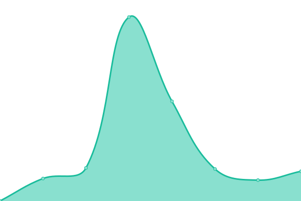
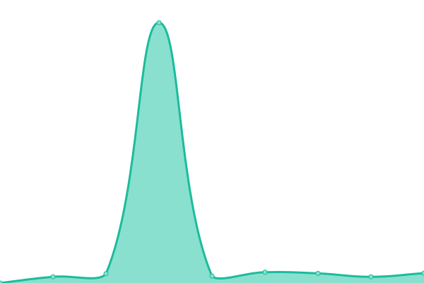

# [📈 Live Status](https://dustplanet.github.io/upptime): <!--live status--> **🟧 Partial outage**

This repository contains the open-source uptime monitor and status page for [Dustplanet](https://dustplanet.de), powered by [Upptime](https://github.com/upptime/upptime).

With [Upptime](https://upptime.js.org), you can get your own unlimited and free uptime monitor and status page, powered entirely by a GitHub repository. We use [Issues](https://github.com/dustplanet/upptime/issues) as incident reports, [Actions](https://github.com/dustplanet/upptime/actions) as uptime monitors, and [Pages](https://dustplanet.github.io/upptime) for the status page.

<!--start: status pages-->
<!-- This summary is generated by Upptime (https://github.com/upptime/upptime) -->
<!-- Do not edit this manually, your changes will be overwritten -->
<!-- prettier-ignore -->
| URL | Status | History | Response Time | Uptime |
| --- | ------ | ------- | ------------- | ------ |
|  [Dustplanet](https://dustplanet.de) | 🟥 Down | [dustplanet.yml](https://github.com/Dustplanet/upptime/commits/HEAD/history/dustplanet.yml) | 

 3845ms
     
 | 

<a href="https://status.dustplanet.de/history/dustplanet">99.86%</a>
    

|  [Jenkins](https://ci.dustplanet.de) | 🟩 Up | [jenkins.yml](https://github.com/Dustplanet/upptime/commits/HEAD/history/jenkins.yml) | 

 647ms
     
 | 

<a href="https://status.dustplanet.de/history/jenkins">100.00%</a>
    

|  [Artifactory](https://repo.dustplanet.de) | 🟩 Up | [artifactory.yml](https://github.com/Dustplanet/upptime/commits/HEAD/history/artifactory.yml) | 

 608ms
     
 | 

<a href="https://status.dustplanet.de/history/artifactory">100.00%</a>
    

|  [Roundcube](https://mail.dustplanet.de) | 🟥 Down | [roundcube.yml](https://github.com/Dustplanet/upptime/commits/HEAD/history/roundcube.yml) | 

 477ms
     
 | 

<a href="https://status.dustplanet.de/history/roundcube">99.88%</a>
    

|  [Nextcloud](https://nextcloud.dustplanet.de) | 🟩 Up | [nextcloud.yml](https://github.com/Dustplanet/upptime/commits/HEAD/history/nextcloud.yml) | 

 3209ms
     
 | 

<a href="https://status.dustplanet.de/history/nextcloud">99.90%</a>
    

<!--end: status pages-->

[**Visit our status website →**](https://dustplanet.github.io/upptime)

## 📄 License

- Powered by: [Upptime](https://github.com/upptime/upptime)
- Code: [MIT](./LICENSE) © [Dustplanet](https://dustplanet.de)
- Data in the `./history` directory: [Open Database License](https://opendatacommons.org/licenses/odbl/1-0/)
